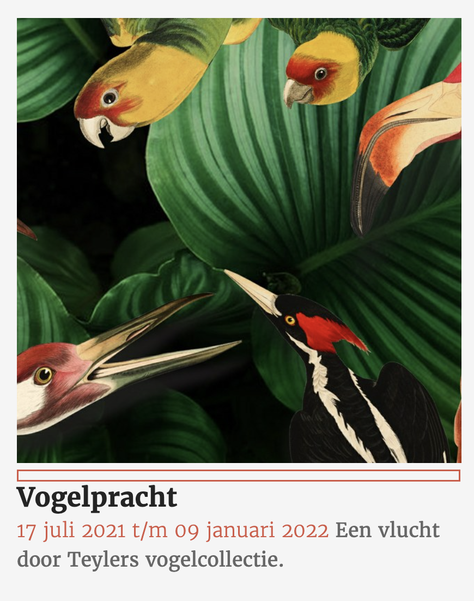

# Procesverslag
Markdown is een simpele manier om HTML te schrijven.  
Markdown cheat cheet: [Hulp bij het schrijven van Markdown](https://github.com/adam-p/markdown-here/wiki/Markdown-Cheatsheet).

Nb. De standaardstructuur en de spartaanse opmaak van de README.md zijn helemaal prima. Het gaat om de inhoud van je procesverslag. Besteedt de tijd voor pracht en praal aan je website.

Nb. Door *open* toe te voegen aan een *details* element kun je deze standaard open zetten. Fijn om dat steeds voor de relevante stuk(ken) te doen.

## Jij

uitwerken voor kick-off werkgroep

### Auteur:
Selina Vanderstalle

#### Je startniveau:
Blauwe piste

#### Je focus:
Responsive
 

## Je website

uitwerken voor kick-off werkgroep

### Je opdracht:
https://www.teylersmuseum.nl/nl

#### Screenshot(s) van de eerste pagina (small screen): 
Home

#### Screenshot(s) van de tweede pagina (small screen):
pagina 2
 

## Breakdownschets (week 1)

uitwerken na afloop 2e werkgroep

### de hele pagina: 

### dynamisch deel (bijv menu): 

## Voortgang 1 (week 2)

uitwerken voor 1e voortgang

### Stand van zaken
In de eerste week heb ik de basis html opgezet voor mijn eerste pagina. Helaas ben ik op dit punt nog niet aan de css begonnen. Ik loop een beetje achter maar ik denk dat het wel goed komt.

### Agenda voor meeting
samen met je groepje opstellen

| student 1      | student 2          | student 3    | student 4        |
| ---            | ---                | ---          | ---              |
| dit bespreken  | en dit             | en ik dit    | en dan ik dat    |
| en dat ook nog | dit als er tijd is | nog een punt | dit wil ik zeker |
| ...            | ...                | ...          | ...              |

### Verslag van meeting
Helaas heb ik de meeting niet kunnen bijwonen.

## Voortgang 2 (week 3)

uitwerken voor 2e voortgang

### Stand van zaken
Ik ben deze week flink aan de slag gegaan met het schrijven van css. De eerste pagina is bijna af. Alleen de footer nog en zodra mijn 2e pagina staat wil ik kijken of ik het voor elkaar krijg om een carousel te maken. Ik heb alleen een probleem met het menu op het desktopscherm als ik het menu open verdwijnt de button.

### Agenda voor meeting
samen met je groepje opstellen

| student 1                         | student 2          | student 3    | student 4        |
| ---                               | ---                | ---          | ---              |
| Hoe los ik het probleem met       | en dit             | en ik dit    | en dan ik dat    |
| mijn nav op?                      | dit als er tijd is | nog een punt | dit wil ik zeker |
|                                   | ...                | ...          | ...              |

### Verslag van meeting
Helaas liep mijn bezoek bij de dokter erg uit waardoor ik niet bij de meeting aanwezig kon zijn.
 
Ik ga even onderzoek doen naar de reden waarom mijn nav zo raar doet en kijken of ik het zelf kan oplossen.

## Toegankelijkheidstest (week 4)

uitwerken na test in 8e voortgang

### Bevindingen
Lijst met je bevindingen die in de test naar voren kwamen:
 - Menu autklappen met key aanslag.
 - Tansition over menulinks.
 - Focusstate doet soms raar.

#### hamburger button
De voice over leest alles netjes uit en je kan door het menu heen met tab, alleen is er niets te zien omdat het menu niet uitklapbaar is. Ik moet er dus voor zorgen dat het mogelijk is om met spatie en/of enter het menu uit te klappen.

Dit kan worden opgelost door javascript toe te voegen die in een eerdere oefening is behandeld.
 
#### transition
Dit kwam naar voren tijdens te test met afleiding. Omdat ik geen transitietijd op de hover had gezet flikkeren de links als je eroverheen hovert dit is volgens Shae erg afleidend voor mensen met ADHD.
 
Dit is makkelijk op te lossen door een transitie aan de hoverstate toe te voegen.

#### Focus 
De focusstate werkt prima en ook alles wordt netjes uitgelezen door de screenreader het viel mij alleen op dat er bij de list items ook ergens tussen de img en de h4 wordt gefocussed ook gebeurt er niks als je op de items klikt. 

 
Dit moet ik even uitzoeken waardoor dat komt. 

## Voortgang 3 (week 4)

uitwerken voor 3e voortgang

### Stand van zaken
Ik had wat problemen met mijn nav, maar die zijn nu opgelost! Ook is mijn tweede pagina helemaal klaar!

### Agenda voor meeting
samen met je groepje opstellen

| student 1      | student 2          | student 3    | student 4        |
| ---            | ---                | ---          | ---              |
| dit bespreken  | en dit             | en ik dit    | en dan ik dat    |
| en dat ook nog | dit als er tijd is | nog een punt | dit wil ik zeker |
| ...            | ...                | ...          | ...              |

### Verslag van meeting
Bij de meeting zijn we, omdat ik neit echt vragen had, even door mijn site heengegaan. We hebben wat kleine dingen behandeld zoals de scroll-overflow en we hebben de button van mijn zoekveld verbeterd. Ik moet na de meeting opzoek naar een oplossing voor mijn datetime probleem. 

## Eindgesprek (week 5)

uitwerken voor eindgesprek

### Stand van zaken
De carousel werkt helaas niet optimaal of zoals ik zou willen, maar hij doet wat ie moet doen. Veder is de site als het goed is helemaal af.

### Screenshot(s)

## Bronnenlijst

continu bijhouden terwijl je werkt

Nb. Wees specifiek ('css-tricks' als bron is bijv. niet specifiek genoeg).

1. Oefeining js van de les
2. Oefening positioneren van de les
3. De les van Sanne op maandag 6 december
4. https://css-tricks.com/css-only-carousel/
5. https://stackoverflow.com/questions/7281765/how-to-embed-an-autoplaying-youtube-video-in-an-iframe
6. https://www.teylersmuseum.nl/nl#/nl/frontpage/ovale-zaal
7. https://css-tricks.com/almanac/properties/o/object-fit/

